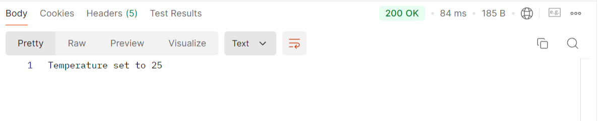
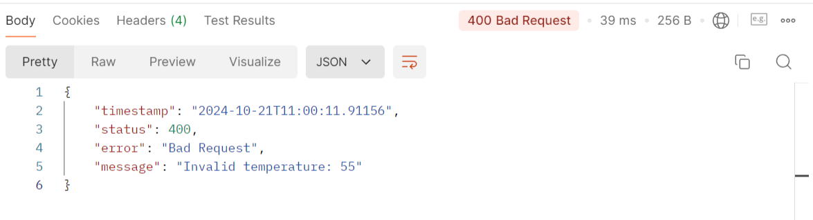

## Custom Exceptions Example Project

This project demonstrates how to use custom exceptions in a Java application to provide more detailed error handling and make debugging easier.

This example project demonstrates how to use custom exceptions to:
- Provides more detailed information about errors
- Customize what types of exceptions can be thrown
- Make your code base cleaner by separating business logic from error handling
- Handle exceptions globally using a 'GlobalExceptionHandler' class

### Getting Started

1. **Clone the repository**:
   ```bash
   git clone https://github.com/EllenHalv/custom-exceptions.git
   cd custom-exceptions
   ```
2. Next, build the project using Maven:
   ```bash
   mvn clean install
   ```

3. Once built, you can run the application with the following command:
   ```bash
   mvn spring-boot:run
   ```

### Exception Example
Let's pretend this application is used to set the temperature of a thermostat. We don't want to allow the temperature to be set under 5 degrees Celsius or over 35 degrees Celsius.

#### Here’s an example of a simple custom exception for invalid temperatures:
```java
// Extend the closest appropriate class
public class InvalidTemperatureException extends IllegalArgumentException {
    public InvalidTemperatureException(String message) {
        super(message);
    }
}
```

#### In the service, we throw this exception when an invalid temperature is entered:
```java
@Service
public class TemperatureService {

    public String setTemperature(int temperature) {
        if (temperature < 5 || temperature > 35) {
            throw new InvalidTemperatureException("Invalid temperature: " + temperature);
        }
        return "Temperature set to " + temperature;
    }
}
```

#### The GlobalExceptionHandler class catches custom exceptions and provides a user-friendly error response:

```java
@RestControllerAdvice
public class GlobalExceptionHandler {

    @ExceptionHandler(InvalidTemperatureException.class)
    public ResponseEntity<ErrorResponse> handleSNMPRequestException(InvalidTemperatureException e) {
        ErrorResponse errorResponse = new ErrorResponse(
                LocalDateTime.now(),
                HttpStatus.BAD_REQUEST.value(), // Set the status code
                HttpStatus.BAD_REQUEST.getReasonPhrase(), // Set the reason phrase
                e.getMessage()
        );
        return new ResponseEntity<>(errorResponse, HttpStatus.BAD_REQUEST);
    }
}
```

The 'ErrorResponse' class is a class we can create and customize to include the information we need to include:

```java
public class ErrorResponse {
    private LocalDateTime timestamp;
    private int status;
    private String error;
    private String message;

    public ErrorResponse(LocalDateTime timestamp, int status, String error, String message) {
        this.timestamp = timestamp;
        this.status = status;
        this.error = error;
        this.message = message;
    }
}
```

### Success example in Postman
If the entered temperature is within our desired range the response will look like this:



### Custom exception example in Postman
If the entered temperature is not within our desired range the custom exception will be thrown and the response will look like this:


